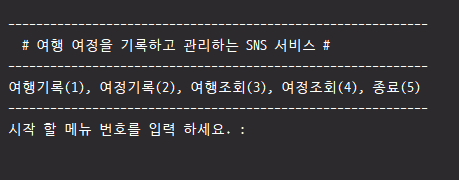
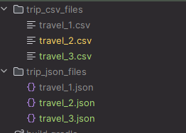
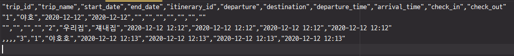
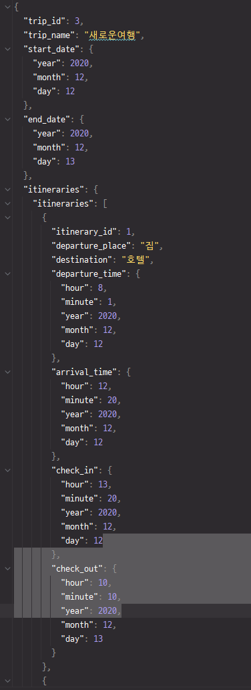

# 토이 프로젝트1 : 여행 여정을 기록과 관리하는 SNS 서비스 1단계

# 6조

이름: 김종훈, 김현아, 성지운, 최다연, 최혜미

## 사용 기술

- 언어 : Java OpenJDK 11
- 빌드 : Gradle 8.1.1
- 테스트 : Junit Jupiter 5.7.2
- 버전 관리 : Git
- 저장소 : GitHub
- 라이브러리 의존성 : Gson, Lombok, OpenCSV

## Branch 전략

Git Flow branch 전략을 상황에 맞게 응용했습니다.

lv.3 : Main(Master) : 정상적으로 애플리케이션의 작동을 보장하는 Master Branch
hotfix : 긴급 수정 branch
lv.2 : Develop : 개발 Branch
lv.1 : Featrue : 각 기능별 개발 Branch

1. git flow 전략에서 개발팀의 상황에 맞게 전략 설정
2. 모든 기능 개발은 dev 에서 나온 feature branch에서 개발합니다
3. 개발이 완료된 feature branch는 dev로 Pull Request를 합니다
4. PR 리뷰가 완료 되었다면 merge 합니다.
5. dev에서 충분한 목표까지 완성 되었다면 main으로 merge 합니다.
6. intellij git flow intergration 설치해서 사용 하면 branch 생성을 편리하게 할 수 있다.

## 프로젝트 학습 목표

- 객체 지향적 설계를 생각해보기
- Git을 이용한 협업
- 테스트 코드의 사용
- MVC 패턴의 구조 학습

## 프로젝트 완료 스크린샷

#### 메인화면

#### 저장된 파일

#### CSV 파일

- CSV파일은 1행은 여행정보, 2행부터는 여정정보만 기록합니다.

#### JSON 파일

- JSON은 각 객체단위로 구조화 해서 파일을 저장합니다.